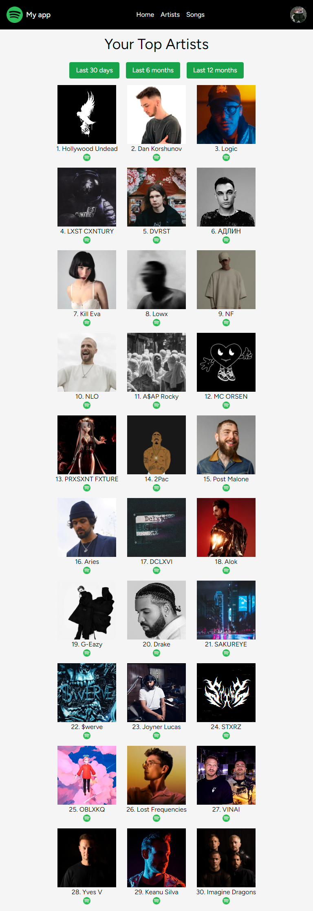

# MyStats
(still in progress) 

## screenshot

## Features
1.Secure sign-in using your Spotify account.
2.Discover your top artists and songs based on your listening history.
3.Interactive interface to switch between different time ranges.
4.Fully responsive design, accessible on desktop and mobile devices.

## Usage
1. Sign in with your Spotify account.
2. Explore your top artists and songs.
3. Use the filter buttons to change the time range.

## Technologies Used
- React
- Next.js
- Typescript
- Tailwind CSS
- Spotify Web API
- OAuth 2.0: For secure authorization with Spotify.

  
 ## Installation
To run this project locally:

1.Clone this repository.
2.Install the project dependencies using npm install or yarn install.
3.Create a .env.local file at the root of the project and set up environment variables. You can use the provided 4. 4.env.example file as a reference.
5.Run the project using npm run dev or yarn dev.
